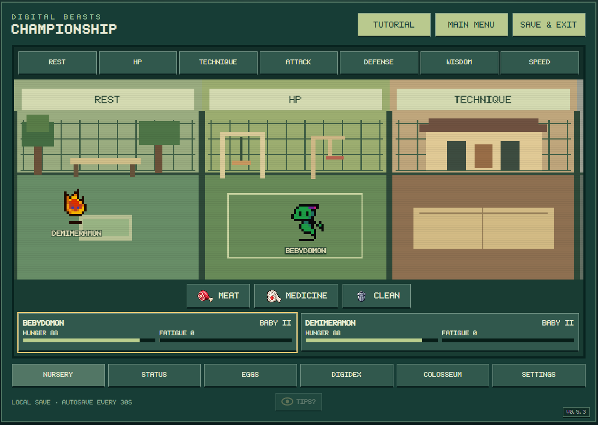
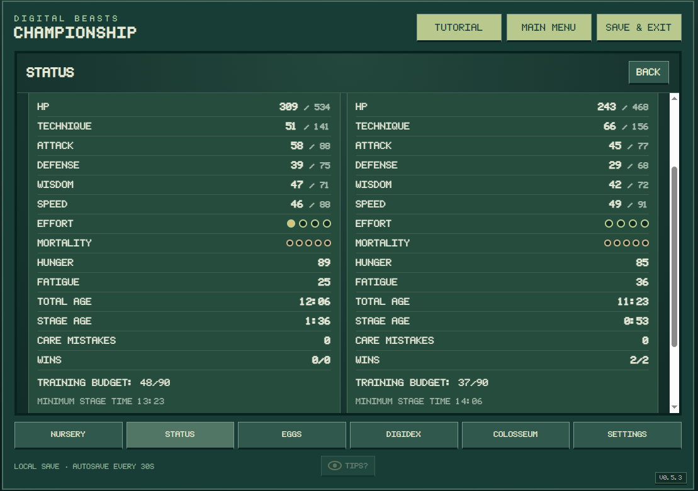
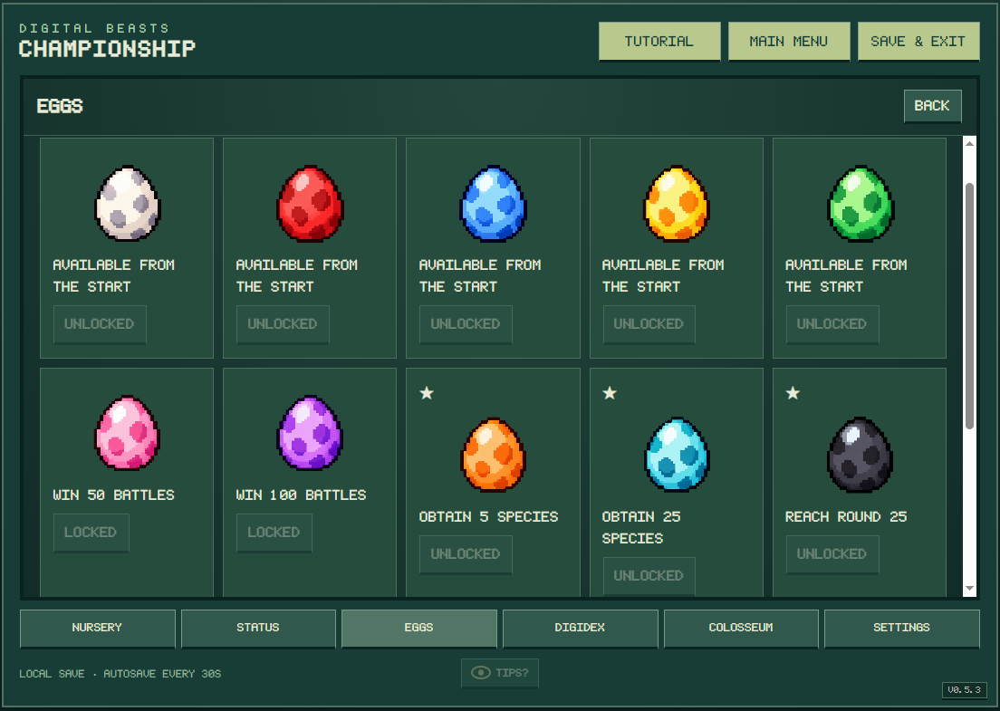
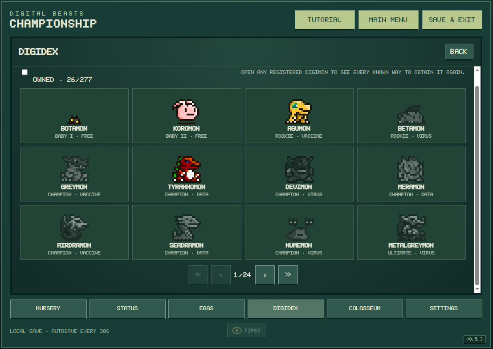
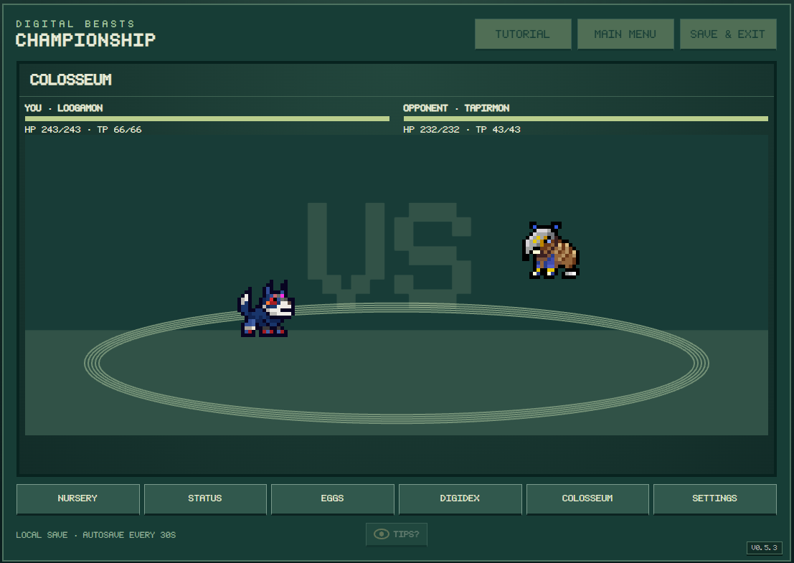

# DIGITAL BEASTS CHAMPIONSHIP

### Raise. Train. Evolve. Battle. Collect.

**A free, non-commercial Digimon virtual-pet fangame for desktop and mobile browsers.**

[**PLAY IN YOUR BROWSER**](https://armster1991.github.io/Digital-Beasts-Championship/)

English and Brazilian Portuguese are available in-game.

---

## What is Digital Beasts Championship?

**Digital Beasts Championship** is a fan-made virtual pet game inspired by the feeling of raising a physical Digimon V-Pet and by the training-and-battle philosophy of **Digimon World Championship**.

You can raise **up to two Digimon at the same time**, care for them inside a large scrolling nursery, train individual attributes, discover branching evolutions, fill the **DIGIDEX**, unlock new Digi-Eggs, fight through the Colosseum, and battle another player online.

The project is intentionally designed to work as a game you can keep open while doing other things. Your Digimon need attention, but they are not meant to demand constant babysitting. Check on them regularly, keep them fed and healthy, give them time to rest, and decide how you want them to grow.

This repository is public so people who never had the opportunity to own a physical V-Pet can still enjoy that style of play — including online battles with friends who may live far away.

---

## The basic loop

Start a new game, choose a Digi-Egg for an empty slot, and raise the Digimon that hatches from it. Feed it when it becomes hungry, keep its environment clean, treat sickness or injuries, let it rest when fatigue becomes high, and drag it into training areas to shape its stats.

Evolution happens automatically when the Digimon has spent enough active time in its current stage and meets one of its available evolution paths. Different training choices, battle results, care history and Digi-Egg origins can lead to different forms.

An Egg hatches very quickly — usually in **under a minute**. Early stages develop within a few minutes, while later stages generally take **tens of minutes** and require more deliberate training and care. The exact requirements are intentionally left for the game itself to teach you.

The built-in **TUTORIAL** contains the full player guide. This README is only the short version.

---

## Nursery & care

The nursery is the main screen of the game. It is wider than the visible screen and can be dragged horizontally on both desktop and mobile. Digimon can also be picked up and moved directly.

Three basic tools are always part of daily care:

- **MEAT** restores Hunger. A well-fed Digimon normally has plenty of time before hunger becomes critical, although training makes it hungry faster. Up to six pieces of meat may exist in the nursery at once.
- **MEDICINE** treats sickness and injuries. Untreated medical problems are more dangerous than ordinary hunger or tiredness, so do not ignore them for too long.
- **CLEAN** removes waste and can also clear abandoned meat from the nursery.

Waste appears periodically. A dirty environment increases health risks, so occasional cleaning matters even when both Digimon look fine. Repeated care failures can also create **Care Mistakes**, which may influence certain evolution paths.

Digimon also accumulate **Fatigue** while training and after battles. Training is meant to happen in multi-minute sessions followed by short periods of rest rather than running forever without interruption.

---

## Mortality & neglect

Digimon do **not** die simply because they become old. There is no hidden old-age timer.

Instead, each stage has a visible **MORTALITY** meter. Long periods of serious neglect can fill it. Leaving Hunger at zero, forcing an exhausted Digimon to remain active, keeping the nursery extremely dirty, or ignoring sickness and injuries can all increase Mortality. Medical neglect is especially dangerous.

You normally have **several minutes to react**, not a few seconds. The system exists to make care meaningful without turning the game into constant maintenance.

Mortality resets when a Digimon evolves. If the meter becomes completely full, that Digimon dies and leaves a grave in its slot. Your collection progress and other permanent unlocks are not erased.

---

## Training, stats & Effort

There are six trainable battle attributes:

**HP · Technique · Attack · Defense · Wisdom · Speed**

Each training area improves a different attribute. Training never makes another stat weaker.

Every stage has a **Training Budget**, so raising a Digimon is about deciding what kind of fighter you want rather than simply maximizing everything. **EFFORT** is displayed with four dots and represents how much training has been completed during the current stage.

If the normal Training Budget is already full but the closest viable evolution still needs a specific stat, the game can temporarily unlock **Extra Training** for only the attributes required by that evolution. This prevents a bad early distribution from permanently trapping the Digimon.

When you are unsure what is missing, watch the **TIPS?** button. It becomes available when the Digimon has been waiting for an evolution and gives a direction without simply revealing the answer.

---

## Evolution

Evolution is automatic and branching. There is no single fixed line for most Digimon.

Possible paths may consider things such as stage training, specific attributes, Effort, battles, victories, win rate, care mistakes and the Digi-Egg the Digimon originally came from.

The goal is to make **how you raise the Digimon** matter. A heavily offensive Digimon may reach a different form from one focused on Defense, Wisdom or Speed, even if both began from the same family.

When a battle causes the final requirement for an evolution to be completed, the game returns to the nursery and shows the evolution there instead of letting it happen unseen behind a result screen.

---

## Digi-Eggs

The game contains **15 Digi-Egg groups**. Several are available from the beginning, while others are unlocked permanently through collection and battle milestones.

Each empty partner slot can hatch a new Egg, so you can raise one Digimon alone or manage two independent partners at once.

Unlocking more Eggs expands the possible families you can raise without deleting your DIGIDEX progress.

---

## DIGIDEX

The **DIGIDEX** currently contains **282 Digimon**, with **277 obtainable through normal raising paths**.

A newly encountered species is permanently registered in the collection. Unregistered Digimon remain visible as dark silhouettes so you can see how much is still left to discover.

Once a species has been registered, selecting it in the DIGIDEX reveals the known in-game ways to obtain it again. This makes the collection useful as a reference without requiring an external evolution guide for Digimon you have already discovered.

---

## Battles & the Colosseum

Battles are **automatic 1v1 fights**. Your job is preparation: raising the Digimon, choosing its training priorities and deciding which partner should fight.

Digimon move around the arena, approach or avoid opponents, use normal and special attacks, defend, evade and occasionally make different decisions based on their own battle behavior. **Technique** is the trained attribute behind special-action resources; during battle, that resource is displayed as **TP**.

Attributes also matter. Vaccine, Virus and Data follow the familiar advantage cycle, while Free Digimon sit outside it.

The **Colosseum** provides a long sequence of opponents drawn from the game's roster. Winning advances your progress, while losing lets you prepare and challenge the same round again. Later battles demand much more developed Digimon than the early rounds.

---

## Online / Netplay

Online mode is available from inside the **Colosseum** menu.

Create or join a room, choose a nickname, optionally protect the room with a password, select a Digimon and ready up. Battles use the same automatic combat system as the Colosseum, and both players may agree to a rematch after a normal result.

If an evolution is triggered by the online battle, that player returns to the nursery to see it instead of remaining in the rematch flow.

The game normally uses the default Championship online service. The **Server** field in **Settings** can be changed to another compatible server address if the default service is unavailable. You do not need to change it for normal play.

---

## Saving your game

Progress is saved automatically in the browser approximately every **30 seconds**.

**MAIN MENU** saves the current state and unloads the active session, so the Digimon stop progressing until you choose **CONTINUE**, **LOAD SAVE** or **NEW GAME** again.

**SAVE & EXIT** also creates a portable backup named **`DBCsave.dbcsave`**. Keep a copy if the save is important to you, especially before clearing browser data, changing browsers or moving between devices.

The game checks periodically for new versions. When **NEW UPDATE AVAILABLE!** appears, save your game before updating. On PC, use **CTRL+F5** after the new version has been published. On mobile, reload or refresh the page.

---

## Desktop & mobile

Digital Beasts Championship is playable with a mouse or touchscreen and has separate layouts designed for desktop and mobile screens.

The nursery, tools, status panels, menus, DIGIDEX, Eggs, Colosseum and Netplay are all available on both versions. The game interface can be switched between **English** and **Brazilian Portuguese** from Settings.

No installer or account is required for browser play.

---

## In-game tutorial

This README deliberately avoids listing every exact timer, evolution number and hidden rule.

Open **TUTORIAL** from the game for the complete player guide. It explains the nursery, care, training, evolution, Mortality, Eggs, DIGIDEX, battles, saves and online play in more detail and is available in both supported languages.

---

## Why this project exists

Digital Beasts Championship is a **free, unofficial and non-commercial fangame created out of love for Digimon and virtual pets**.

I wanted to make something that could capture part of the fun of raising a real V-Pet while being easy to open in a browser, playable on a phone or computer, and capable of letting friends battle even when they are nowhere near each other physically.

This project is not affiliated with, sponsored by or endorsed by Bandai, Bandai Namco, WiZ, Toei Animation or any other Digimon rights holder. No ownership of Digimon characters, names, devices, artwork or trademarks is claimed.

---

## Credits & acknowledgements

**Project, game design, programming and adaptation**  
**Armster** — [armster1991 on GitHub](https://github.com/armster1991)

**Digimon / Digital Monster**  
Digimon and the Digital Monster virtual-pet franchise were created through the work of **Bandai** and **WiZ**, with the franchise traditionally credited to **Akiyoshi Hongo**. Important original Digital Monster development staff include **Makoto Kitagawara**, **Kenji Watanabe** and **Ayumu Horimura**. Kenji Watanabe has been one of the central character designers of Digimon since the original LCD toys.

**Digimon Pendulum**  
The original Pendulum project was developed at **WiZ** and **Bandai**. **Makoto Kitagawara** led its development and originated the project plan, **Kenji Watanabe** handled art direction and character design, and **Kensuke “Volcano Ota” Ota** was involved from Bandai's side in the planning of the series.

**Sprites**  
The Digimon LCD sprite material used as the visual foundation for this fangame comes from preserved **Digital Monster Ver.20th** and **Digimon Pendulum Color** sprite sheets available through **The Spriters Resource**, with the relevant sheets ripped/uploaded by **airshuffler**. Additional device and species reference material was cross-checked through **Wikimon**.

**Research references**  
The project has also benefited from the Digimon community's preservation work, especially **Humulos**, **Wikimon**, official Digimon profile material, device documentation and community research around V-Pet evolution and behavior.

Thank you to everyone who has preserved, documented, researched and shared information about Digimon virtual pets over the years.

---

### Made by a fan, for other fans.

**DIGITAL BEASTS CHAMPIONSHIP**

