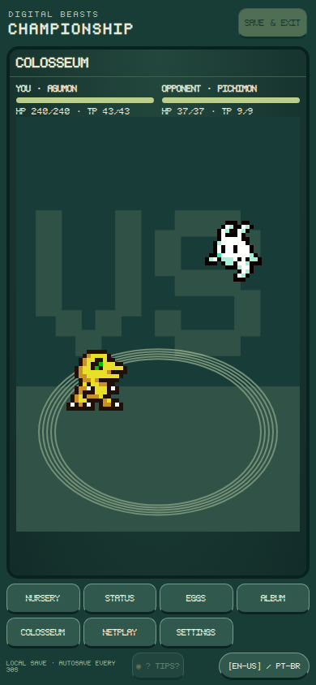

# Digital Beasts Championship

A browser-based virtual pet fangame by **Armster**, inspired by **Digimon World Championship**. Raise two companions, shape their growth through training, and watch their personalities unfold in automatic battles.

## A small world to care for

- Raise **up to two independent Digimon**, including two of the same species.
- Explore a scrolling nursery with a resting area and six distinct training cages.
- Drag companions, place up to **six active pieces of Meat**, apply medicine, and sweep up waste with a mouse or touchscreen.
- Develop **HP, TP/Technique, Attack, Defense, Wisdom, and Speed**. Training never lowers another stat; permanent stage budgets grow from 12 points at Baby I to 480 at Ultra, with a normal 50% per-stat cap and a 240-point absolute per-stat ceiling.
- Discover automatic, branching evolutions. Each companion has its own age and development timer.
- There is **no death from old age**: a well-cared companion can live indefinitely. Neglect fills the visible **MORTALITY** meter, however; filling every dot turns that partner into a grave until the player releases the slot.

## Prepare, then let them fight

Battles are automatic 1v1 encounters with movement, close-range attacks, projectiles, defense, evasion, and species-specific behavior. TP limits special attacks, while occasional hesitation adds personality without repeated stun-locks.

At 90 seconds, **Sudden Death** turns the arena red, accelerates actions and lowers defense and evasion for both fighters.

The **Colosseum contains 282 opponents**, one for every catalog entry, dynamically ordered by stage and combat strength. Online rooms support a host and challenger, optional passwords, ready checks, and mutually accepted rematches.

## Discover with the DIGIDEX

The **DIGIDEX** contains **282 animated entries**, of which **277 are obtainable** in this version. The v0.4 expansion integrates the six Pendulum Color families while preserving all 134 original Championship IDs. Five legacy fusion-only species remain visible as Colosseum opponents; Jogress itself is still outside this fork's scope.

Once a Digimon has been registered, its DIGIDEX card can be clicked or tapped to reveal every current in-game route for obtaining it again. These details are generated from the same evolution resolver used by the pet engine, including minimum stage time, training/stat thresholds, care mistakes, Effort, battle/win requirements, win ratio, and Digi-Egg origin where applicable. Baby I entries show the existing Digi-Eggs that can hatch them and the real hatch chance.

The same **15 Digi-Eggs** remain in use, but each now has **two possible Baby I outcomes**. The result is chosen once when the egg is created and stored in the save, so reloading never rerolls the hatch. Collection milestones and battle achievements continue to unlock the existing egg artwork.

## Pendulum Color expansion

Version 0.4 adds **148 new species** from six user-provided Pendulum Color sprite sheets. In total, 181 unique Pendulum Color species have 12-frame animation rows covering idle, eating, sleep, refusal, emotion, hurt, and attack states. Existing species use the new Pendulum Color art when available; species not present in those sheets keep their legacy sprites. Evolution data for the expansion is source-traceable in `source/PENC_EXPANSION_RESEARCH.md`.

## Play and save

Open **`index.html`** to play locally, or play the hosted version in a modern browser. Local play needs no installer or account. Online matchmaking requires the Championship lobby service.
Version 0.5.0 keeps the browser and Worker battle validators synchronized with the larger training budgets. The public Worker must be redeployed whenever `server/battle.js` changes so legitimate trained fighters are accepted online.

Progress autosaves in the browser every 30 seconds. **Save & exit** downloads a portable `.dbcsave` backup; **Load save** imports it. This fork uses separate saves from Digital Beasts HTML / Ver.20th. Browser storage can be cleared by the browser, so keep an exported backup of progress you want to preserve.

The interface supports **English and Brazilian Portuguese**, desktop, and mobile play with a portrait-first phone layout. On phones the nursery occupies most of the vertical screen, with tools, partner cards and navigation arranged below it; long submenus keep internal vertical scrolling. Battle rendering uses a mild mobile camera zoom that follows the local player’s Digimon in both Colosseum and Netplay. **Settings** shows the current game version (`v0.5.0`) for easy build identification. The nursery also checks the hosted `version.json`: when a newer build exists it explicitly recommends saving, then tells PC players to use **CTRL+F5** and mobile players to refresh/reload the page. Music and sound effects have independent volume controls and start at 10%. **TUTORIAL** is available beside **MAIN MENU** in the top-right, with an indexed player guide in both supported languages.

## Balance revision 0.5

Evolution pacing is now **30 s / 3 min / 7 min / 15 min / 25 min / 35 min / 45 min** from Egg through the Mega→Ultra step. Permanent trained stats survive evolution, but a separate stage-training counter resets each evolution and drives evolution requirements and the four Effort dots. Care mistakes are recorded once per unresolved incident after two minutes instead of repeating forever. Hunger at zero or ignored exhaustion adds about one MORTALITY point per seven minutes; sickness or injury is twice as fast, while a very dirty nursery adds slower pressure. MORTALITY resets on evolution.

If a completed Coliseum or Online battle immediately unlocks an evolution, the game returns to the nursery and centers that partner so the evolution animation is visible. In Online play that player leaves the room cleanly instead of leaving the opponent waiting on a rematch that cannot happen.

## About this fan project

Armster created this project for personal enjoyment and for fellow virtual pet fans, and owns an original 20th anniversary V-Pet. This is an experimental, noncommercial fangame, unaffiliated with or endorsed by the owners of Digimon. Digimon characters and related artwork belong to their respective owners.

Combat statistics and evolution requirements are original adaptations for this game, informed by species profiles rather than exact reproductions of another game's numbers.
